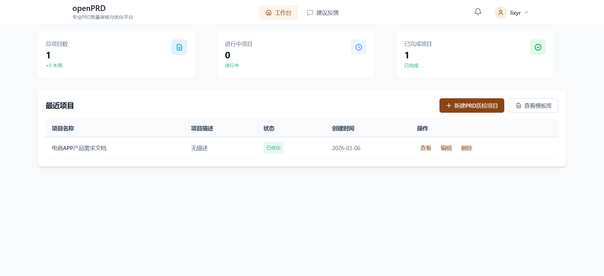
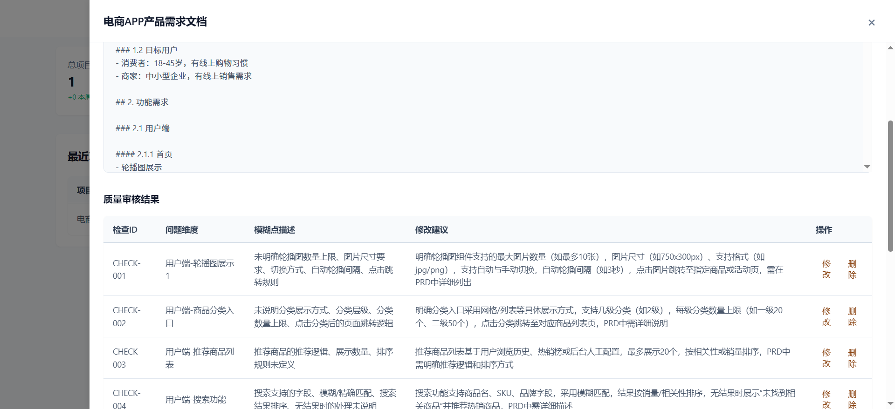
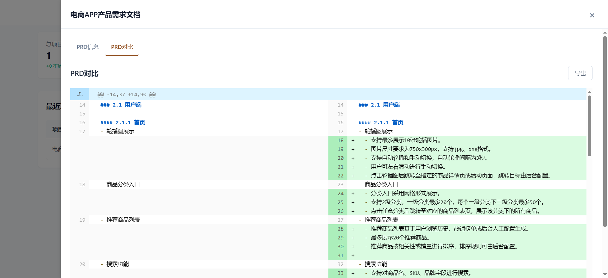

# openPRD - Product Requirement Document Management & Optimization Platform

[English](README_EN.md) | [中文](README.md)

openPRD is a platform focused on Product Requirement Document (PRD) management, analysis, and optimization. It helps product managers and development teams create, review, and improve PRD documents more efficiently.

## ✨ Why openPRD?

- 🎯 **PRD Quality Management** - Quality checking and optimization system specifically designed for PRD documents
- 🤖 **AI-Powered Analysis** - LLM-based PRD quality assessment and optimization suggestions
- 🔄 **Real-time Version Comparison** - Intuitive display of differences before and after optimization
- 📦 **Out of the Box** - Complete user system, template library, and notification system
- 🔌 **Easy to Extend** - Modular design for easy secondary development

## 📸 Screenshots







## 📋 Features

### 🏗️ Core Features
- **User Authentication**: User registration, login, and password reset
- **Project Management**: Create, edit, and delete PRD projects
- **PRD Analysis & Optimization**: AI-based PRD quality checking and optimization suggestions
- **Template Management**: PRD template library with creation, usage, and management support
- **Feedback System**: Users can submit suggestions, bug reports, and feature requests
- **Notification System**: Real-time notifications for PRD analysis results and system messages
- **WebSocket Support**: Real-time communication capabilities

### 🔧 Technical Features
- **Modular Design**: Clear directory structure for easy extension
- **Environment Variable Configuration**: Support for different environment configurations
- **Unified Logging Management**: Detailed log recording
- **Request Context and Logging Middleware**: Enhanced request handling
- **Comprehensive Error Handling**: Unified exception handling mechanism
- **CORS Middleware Configuration**: Cross-origin request support

## 🛠️ Tech Stack

| Category | Technology | Version |
|----------|------------|---------|
| Backend Framework | FastAPI | 0.125.0 |
| Configuration Management | Pydantic Settings | 2.12.0 |
| Database | MySQL | Latest |
| NoSQL Database | MongoDB | Latest |
| Authentication | JWT | Latest |
| Frontend Framework | React | 18.2.0 |
| Frontend Build Tool | Vite | 5.1.0 |
| State Management | Zustand | 5.0.11 |
| UI Components | Headless UI | 2.2.9 |
| Editor | React MD Editor | 4.0.11 |
| Animation Library | Framer Motion | 12.34.4 |
| Icon Library | Lucide React | 0.576.0 |

## 📁 Project Structure

```
openPRD/
├── alembic/              # Database migration tool
│   ├── versions/         # Migration version files
│   ├── README
│   ├── env.py
│   └── script.py.mako
├── app/                  # Main application directory
│   ├── api/              # API routes
│   │   ├── __init__.py
│   │   ├── auth.py       # Authentication APIs
│   │   ├── feedback.py   # Feedback APIs
│   │   ├── notification.py # Notification APIs
│   │   ├── prd.py        # PRD APIs
│   │   ├── project.py    # Project APIs
│   │   ├── template.py   # Template APIs
│   │   └── websocket.py  # WebSocket APIs
│   ├── config/           # Configuration management
│   │   ├── __init__.py
│   │   └── settings.py   # Application settings
│   ├── core/             # Core functionality
│   │   ├── __init__.py
│   │   ├── errors.py     # Error definitions
│   │   └── exception_handlers.py # Exception handlers
│   ├── database/         # Database operations
│   │   ├── __init__.py
│   │   ├── mongo_operations.py # MongoDB operations
│   │   └── mysql_operations.py # MySQL operations
│   ├── middleware_config/ # Middleware configuration
│   │   └── middleware.py  # Custom middleware
│   ├── models/           # Data models
│   │   ├── __init__.py
│   │   ├── auth_schemas.py # Authentication schemas
│   │   ├── feedback_schemas.py # Feedback schemas
│   │   ├── mongo_models.py # MongoDB models
│   │   ├── mysql_models.py # MySQL models
│   │   ├── notification_schemas.py # Notification schemas
│   │   ├── notification_setting_schemas.py # Notification settings schemas
│   │   ├── prd_schemas.py # PRD schemas
│   │   ├── project_schemas.py # Project schemas
│   │   └── template_schemas.py # Template schemas
│   ├── utils/            # Utility functions
│   │   ├── __init__.py
│   │   ├── json_utils.py # JSON utilities
│   │   ├── llm_client.py # LLM client
│   │   ├── logger.py     # Logging utilities
│   │   ├── mongo_client.py # MongoDB client
│   │   ├── mysql_client.py # MySQL client
│   │   └── websocket_manager.py # WebSocket manager
│   ├── __init__.py
│   └── main.py           # Application entry point
├── frontend/             # Frontend application
│   ├── public/            # Static assets
│   ├── src/               # Frontend source code
│   │   ├── components/    # Components
│   │   ├── pages/         # Pages
│   │   ├── services/      # Services
│   │   ├── store/         # State management
│   │   ├── styles/        # Styles
│   │   ├── utils/         # Utility functions
│   │   ├── App.css        # Application styles
│   │   ├── App.jsx        # Application component
│   │   ├── main.jsx       # Application entry point
│   │   └── router.jsx     # Router configuration
│   ├── index.html         # HTML template
│   ├── package-lock.json  # Frontend dependency lock file
│   ├── package.json       # Frontend dependencies
│   ├── postcss.config.cjs # PostCSS configuration
│   └── vite.config.js     # Vite configuration
├── .gitignore            # Git ignore file
├── PRD撰写优化Prompt.md # PRD optimization prompt
├── PRD质量审核Prompt.md # PRD quality review prompt
├── README.md             # Project documentation
├── alembic.ini           # Alembic configuration
└── requirements.txt      # Python dependencies
```

## 🚀 Getting Started

### Prerequisites

- Python 3.12+
- Node.js 16+ (for frontend development)
- MySQL 8.0+
- MongoDB 4.0+

### Installation & Configuration

1. **Clone the repository**

```bash
git clone https://github.com/lxiasen/openPRD.git
cd openPRD
```

2. **Configure environment variables**

Create a `.env` file in the project root directory

3. **Install backend dependencies**

```bash
pip install -r requirements.txt
```

4. **Install frontend dependencies**

```bash
cd frontend
npm install
```

### Database Initialization

1. **MySQL Database Initialization**

   - Ensure MySQL service is running
   - Create database `openprd`
   - Run database migrations:

```bash
# Generate migration files (if needed)
alembic revision --autogenerate -m "Initial migration"

# Run migrations
alembic upgrade head
```

2. **MongoDB Database Initialization**

   - Ensure MongoDB service is running
   - MongoDB will automatically create the database and collections on first connection

### Running the Services

**Backend Service**

```bash
# Start backend service
uvicorn app.main:app --host 0.0.0.0 --reload
```

**Frontend Service**

```bash
cd frontend
npm run dev
```

Services will be available at:
- Backend API: `http://localhost:8000`
- Swagger Documentation: `http://localhost:8000/docs`
- Frontend Interface: `http://localhost:5173`

## 📖 User Guide

### 1. User Authentication

- **Register**: Visit `http://localhost:5173/register` to create a new account
- **Login**: Visit `http://localhost:5173/login` to log in to the system
- **Forgot Password**: Visit `http://localhost:5173/forgot-password` to reset your password

### 2. Project Management

- **Create Project**: Click the "New Project" button on the workspace page
- **Edit Project**: Click on a project card to enter the project detail page, where you can edit project information
- **Delete Project**: Click the "Delete Project" button on the project detail page

### 3. PRD Management

- **Edit PRD**: Edit PRD content in the "PRD Editor" tab on the project detail page
- **Analyze PRD**: Click the "Analyze PRD" button, and the system will perform quality checks on the PRD
- **View Quality Report**: Check analysis results and suggestions in the "Quality Report" tab
- **View Optimized PRD**: View the system-optimized PRD version in the "Optimized PRD" tab
- **Compare Differences**: View differences between the original and optimized PRD in the "Diff Comparison" tab
- **Export PRD**: Click the "Export" button to export PRD in different formats

### 4. Template Management

- **Browse Templates**: Click the "Template Library" button on the workspace page
- **Use Template**: Select a template and click "Use Template" to create a new project
- **Search Templates**: Use the search box and category filters to find templates

### 5. Feedback System

- **Submit Feedback**: Visit `http://localhost:5173/feedback` to submit feedback
- **Select Feedback Type**: You can choose suggestion, bug, feature request, or other types

### 6. Notification System

- **View Notifications**: Click the notification icon at the top of the page to access the notification center
- **Configure Notifications**: Set notification preferences in personal settings

## 🧪 Testing

Run the test suite:

```bash
python -m unittest discover tests
```

## 📝 Extension Suggestions

1. **Add more AI analysis features**: Enhance PRD analysis depth and accuracy
2. **Add team collaboration features**: Support multi-user collaborative editing of PRDs
3. **Add version control**: Support PRD version management and rollback
4. **Add more export formats**: Support exporting to Word, PDF, and other formats
5. **Add integration features**: Integrate with other project management tools
6. **Add API documentation**: Complete API documentation for third-party integration
7. **Add performance optimization**: Optimize system performance to support larger-scale PRD management

## 🤝 Contributing

Contributions are welcome! Please follow these steps:

1. **Fork the repository**
2. **Create a feature branch** (`git checkout -b feature/AmazingFeature`)
3. **Commit your changes** (`git commit -m 'Add some AmazingFeature'`)
4. **Push to the branch** (`git push origin feature/AmazingFeature`)
5. **Create a Pull Request**

### Development Guidelines

- Please ensure your code follows the project's code style
- Test your changes before submitting
- Update relevant documentation (if needed)

## ⭐ Support

If this project is helpful to you, please give it a Star!

If you find any issues or have improvement suggestions, feel free to:
- Submit an [Issue](https://github.com/lxiasen/openPRD/issues)
- Submit a Pull Request

## 📧 Contact

- Project Homepage: https://github.com/lxiasen/openPRD
- Issue Tracker: https://github.com/lxiasen/openPRD/issues

## 📄 License

This project is licensed under the MIT License. See the [LICENSE](LICENSE) file for details.

---

<p align="center">
  
  
  
</p>
